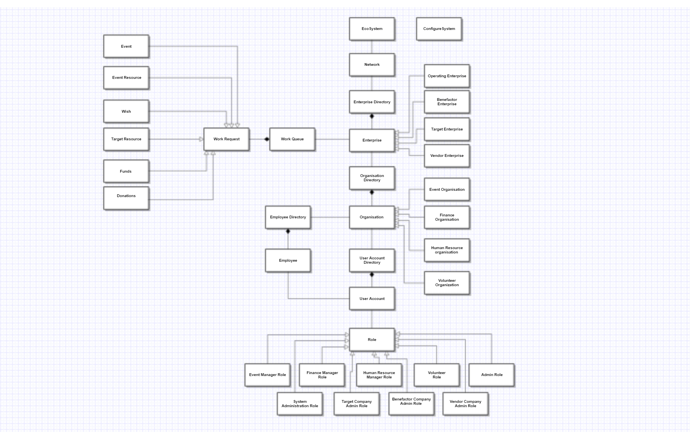

# NGO-Manager
A Java Swing App for automating daily operations of Non-Governmet Organization such as donations, finances, events, orders, requests, relationships with other companies, notifications and analytics.
## Object Model:

